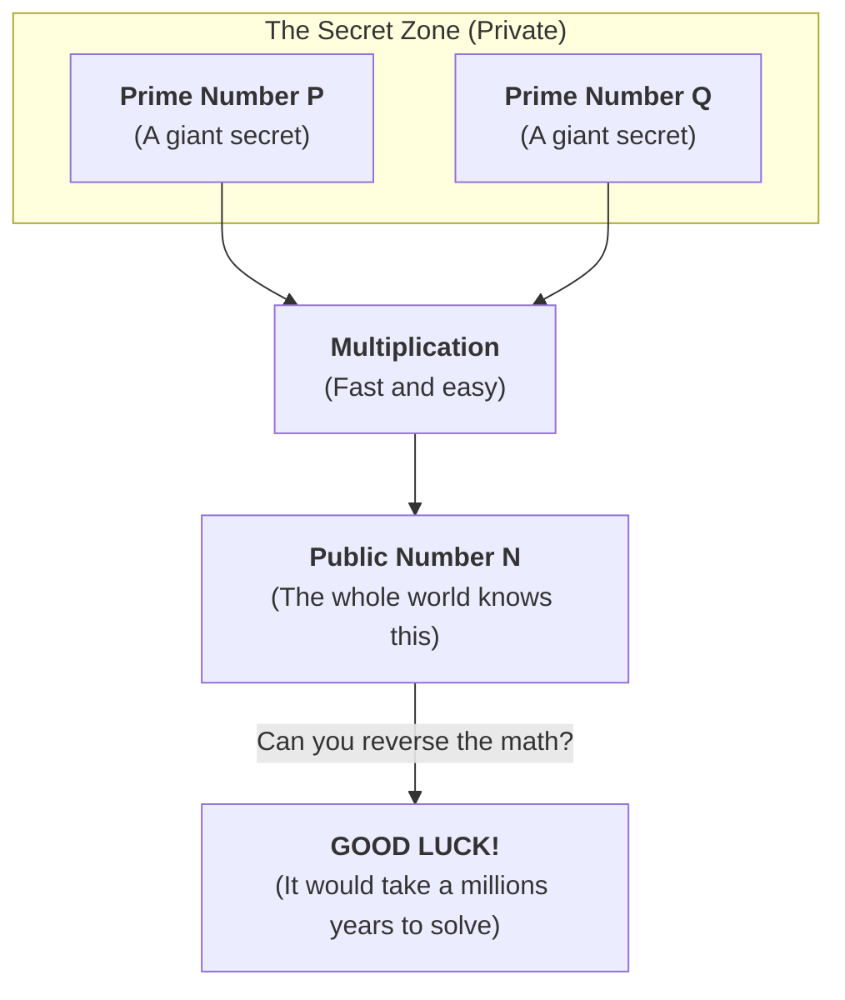
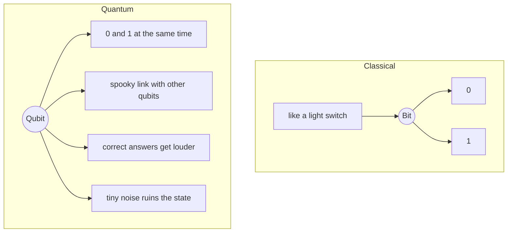

## How It All Started

I was chatting with a colleague, waiting for the coffee machine to do its thing, when he dropped a couple of interesting terms that I wasn't aware of before: "quantum-safe" and "harvest now, decrypt later." They stuck in my head like a song.

That evening I went home and did what any curious engineer does: opened twenty browser tabs and understood a few of them.

The next day, there was a session about _"quantum-safe cryptography"_ at an event I was attending. The speaker was clearly brilliant. The slides were dense. I left with even more questions than I had before.

So I kept looking deeper. This post is the result of that search. It is not an academic paper. It is just me, a software engineer, trying to make sense of something complex and explain it in a way that is easy to follow.

## Why Encryption Exists

Let's start at the very beginning.

You want to send a message to a friend. The message travels across wires, routers, and servers you do not control. **Anyone sitting in the middle can read it.** That is the problem encryption solves.

- **Plaintext**: Original readable message
- **Ciphertext**: Scrambled message
- **Key**: Secret that converts between them

Only the one with the right key can reverse the transformation and read the original message.

Without encryption, passwords, tokens, financial transfers, private messages would be readable by anyone on the network. We don’t really debate whether encryption is necessary. The real question is: **how do we make it strong enough that breaking it is not worth the effort?**

## Keeping Secrets by Hand

Early encryption was designed for humans, which meant it was also **breakable** by humans.

The **[Caesar cipher](https://en.wikipedia.org/wiki/Caesar_cipher)** is the classic example. Shift letters by a fixed number. That’s the entire algorithm. The key is just a number between 1 and 25. There are only **25 possible keys**. A determined person could try all of them in minutes.

More advanced versions, like the **[Vigenère cipher](https://en.wikipedia.org/wiki/Vigen%C3%A8re_cipher)**, used a keyword to vary the shift. Harder to crack by hand, but still vulnerable to **frequency analysis**. Letters do not appear randomly in real language. Count the ciphertext characters, and patterns emerge.

This worked... until it did not. The moment there is a machine that could try all combinations faster than a human, the game changed.

## The Shift to One-Way Maths

The next big leap was moving from hand-solvable puzzles to **mathematical problems that are easy in one direction but extremely hard to reverse.**

The classic example is _multiplication vs factoring_. Multiplying two large prime numbers together takes microseconds. Factoring the result back? On a classical computer, that can take millions of years for large enough numbers. That asymmetry is the foundation of **[RSA encryption](<https://en.wikipedia.org/wiki/RSA_(cryptosystem)>)**.




**[Elliptic Curve Cryptography](https://en.wikipedia.org/wiki/Elliptic-curve_cryptography)** works on a similar idea but uses a different mathematical structure: points on an elliptic curve. The **easy direction** is multiplying a point by a number. The **hard direction** is figuring out what number was used.

> The maths behind asymmetric cryptography goes deeper than what's needed day-to-day. I know the intuition, I know the properties, and I think that is completely fine. Most engineers using TLS every day are in the same boat. The important thing is understanding **what guarantees these systems provide** and **what assumptions they rely on.**

The assumption: **certain mathematical problems are hard.** Tough enough that even with all the computers in the world working together, a properly sized RSA key is unbreakable in any reasonable timeframe.

That assumption held for decades.

## Bigger Keys, Bigger Safety Net

As computers got faster, the response was simple: **use bigger keys.** RSA moved from 512-bit and 1024-bit to 2048-bit as the minimum recommended and 4096-bit for long-lived certificates.

The same pattern played out with symmetric encryption:

- **[DES](https://en.wikipedia.org/wiki/Data_Encryption_Standard)** (56-bit keys) was broken in 1999 by brute force
- **[AES](https://en.wikipedia.org/wiki/Advanced_Encryption_Standard)** replaced it with 128, 192, or 256-bit keys, making the keyspace so large that brute force is not a realistic attack

This is the **arms race model** of cryptography: attackers get more computation power, defenders use bigger keys. Not elegant, but it works.

This worked... until a **fundamentally different kind of computer** entered the picture.

## Quantum Computing Changes the Rules

Here is where things get genuinely strange.

**Classical computers** work with bits. A bit is either `0` or `1`. Every computation is a sequence of operations on bits. Fast, deterministic, well-understood.

**Quantum computers** work with **qubits**. And qubits are weird in a very specific, physics-breaking way:




[The Four key principles of quantum mechanics](https://www.ibm.com/think/topics/quantum-computing#Four+key+principles+of+quantum+mechanics):

- **Superposition**: A qubit can represent multiple states at once.
- **Entanglement**: Qubits can be linked, so the state of one affects another regardless of distance.
- **Interference**: Algorithms can amplify correct answers and cancel out incorrect ones.
- **Decoherence**: Environmental noise that destroys quantum states. Avoiding this is the biggest challenge in building quantum computers.

> The physics behind quantum computers runs deep into quantum mechanics, and the full picture is genuinely complex. But what matters for this post is what quantum computing actually means in practice.

For certain classes of problems, quantum computers can find answers dramatically faster than classical computers, and one of those problems is factoring large numbers.

## Shor's Algorithm

In 1994, **Peter Shor** published an algorithm showing that a powerful enough quantum computer could factor large numbers in **polynomial time**.

Let that sink in.

This is the real turning point. The entire security of asymmetric cryptography depends on factoring being hard. **[Shor's algorithm](https://en.wikipedia.org/wiki/Shor%27s_algorithm) makes it not hard.**

On a powerful enough quantum computer, RSA keys that would take classical computers millions of years to break could be broken in a few hours. Shor's algorithm can also solve the elliptic curve discrete logarithm problem efficiently.

This is not a theoretical concern about some distant future. It is a **known algorithm, published more than thirty years ago**, waiting for the hardware to catch up.

As of today, quantum computers are still in the **"noisy intermediate-scale quantum" (NISQ) era**: hundreds to thousands of qubits, but error-prone and hard to keep stable. Running Shor's algorithm on RSA-2048 would require **millions of stable, error-corrected qubits**. We are not there yet. The direction is clear, but the timeline is uncertain, which is exactly the problem.

## Harvest Now, Decrypt Later

Here is the part that should make us uncomfortable, even if quantum computers are still years away. However, attackers can collect encrypted data **today** and store it. When quantum computers become powerful enough, they decrypt it **then**.

This is called **"harvest now, decrypt later" (HNDL)**, and it is not hypothetical. I can bet that anyone who can run a serious long-term intelligence operation is already doing exactly that.

The window of vulnerability is not when quantum computers arrive. It is now, for any data that needs long-term confidentiality.

### Does Quantum Break ALL Encryption?

No. The real vulnerability is asymmetric cryptography. Symmetric encryption like AES uses the same key to encrypt and decrypt. Its security does not rely on hard maths problems like factoring, it relies on **sheer key size and the complexity of the cipher itself.**

There is an algorithm called [Grover's algorithm](https://en.wikipedia.org/wiki/Grover%27s_algorithm) that gives quantum computers a speedup against symmetric encryption, but it only cuts the effective key size in half. AES-256 effectively becomes AES-128 strength against a quantum attacker. That is still very secure. **The fix is simple: use AES-256 and we are fine.**

Hashing algorithms like [SHA-256](https://en.wikipedia.org/wiki/SHA-2) face only minor speedups for attackers. The fix for those is straightforward (use larger output sizes if needed).

## Post-Quantum Cryptography

So if asymmetric cryptography is vulnerable, what replaces it?

The answer is a new class of algorithms based on mathematical problems that are hard for **both** classical and quantum computers. The leading approach is **[lattice-based cryptography](https://blog.cloudflare.com/lattice-crypto-primer)**.


A lattice is a grid of points in space. Think of graph paper, now extend that to **hundreds or thousands of dimensions.** In these high-dimensional lattices, there are two famously hard problems: the **Shortest Vector Problem (SVP)** the shortest non-zero vector in the lattice, and the **Closest Vector Problem (CVP)** given a point, find the nearest lattice point.

These are believed to be **hard even for quantum computers.** Shor's algorithm works because asymmetric cryptography has a specific algebraic structure that quantum computers can exploit through quantum tricks. Lattice problems do not have that structure.

In practice, many systems use the **Learning With Errors (LWE)** technique. The idea is straightforward and slightly evil. Imagine someone gives you a list of maths equations, but they add a tiny bit of random "noise" to every single one. Now solving the maths should be easy, but the noise ruins the structure. The many possible answers that **almost work** make finding the right answer a total nightmare.

### The New Standards

**[NIST](https://www.nist.gov/news-events/news/2024/08/nist-releases-first-3-finalized-post-quantum-encryption-standards)** finalised its first post-quantum cryptographic standards:

- **[ML-KEM](https://csrc.nist.gov/pubs/fips/203/final)**: For key exchange.
- **[ML-DSA](https://csrc.nist.gov/pubs/fips/204/final)** and **[SLH-DSA](https://csrc.nist.gov/pubs/fips/205/final)**: For digital signatures.

**ML-KEM** is the headline algorithm. It allows two parties to establish a shared secret over an insecure channel, which is exactly what RSA or ECC is used for in protocols like TLS.

These are not experimental algorithms. They have been through **years of public inspection** by the global cryptography community. They are ready to use.

## Where We Are Now

The standards exist. The algorithms are ready. The ecosystem is catching up. **OpenSSL 3.x** is adding post-quantum key exchange support. **TLS 1.3** is the foundation that post-quantum algorithms will plug into. The [Open Quantum Safe project](https://openquantumsafe.org/) provides open-source implementations we can use today.

Most production systems have not migrated yet, and that is expected. Cryptographic transitions are slow. TLS 1.3 was finalised in 2018 and is still not universal.

The quantum computer that breaks asymmetric cryptography does not exist yet. But the data being encrypted today might still need to be secret when it does.

## What Should We Do?

Swapping algorithms is the easy part. The real challenge is **discovering where cryptography is embedded in your systems.** Many systems have cryptographic dependencies buried in third-party libraries, hardware security modules, or protocols that have not been touched for years.

**Understand your exposure**

Audit your systems for TLS certificates, SSH keys, JWT signing, and VPN configurations. Anywhere asymmetric cryptography is in use is a potential migration target.

**Prioritise long-lived sensitive data**

If your data needs to remain secret for more than 10 years, the HNDL threat applies today.

**Use hybrid approaches**

Combine classical and post-quantum algorithms. If either remains secure, your data stays protected.

**Stay informed**

Follow NIST and platform vendor updates.

### For Java and JVM Developers

Java developers have a practical path forward today. If you're using the [Bouncy Castle](https://www.bouncycastle.org/) library, it already supports ML-KEM and other post-quantum algorithms. Here is a minimal example of key encapsulation using ML-KEM:

```java
// Register the Bouncy Castle PQC provider
Security.addProvider(new BouncyCastlePQCProvider());

// Generate an ML-KEM (formerly Kyber) key pair
KeyPairGenerator kpg = KeyPairGenerator.getInstance("ML-KEM", "BCPQC");
kpg.initialize(MLKEMParameterSpec.ml_kem_768, new SecureRandom());

KeyPair keyPair = kpg.generateKeyPair();

// The public key is shared; the private key stays secret ;)
PublicKey publicKey = keyPair.getPublic();
PrivateKey privateKey = keyPair.getPrivate();
```

Java versions 24+ are also adding native support for post-quantum algorithms. We won't need a third-party library eventually.

For now, the practical steps are:

- Audit the use of asymmetric cryptography and experiment using Bouncy Castle in your projects with ML-KEM
- Watch for newer Java versions and the JDK's built-in post-quantum support

## Final Thought

The history of encryption is a history of **staying one step ahead.** Encryption has always evolved when assumptions changed. Not because the old assumptions were wrong, but because a new kind of computer changes what **"not feasible"** means.

We’re not in crisis mode. But we’re also not too early to care. I think the right approach is **awareness**, **experiment**, then **gradual adoption**.

## Further Reading

- [Cloudflare's Post-Quantum Blog Series](https://blog.cloudflare.com/tag/post-quantum) Practical, engineering-focused writing on the transition
- [Post-Quantum Cryptography at Google](https://security.googleblog.com/2024/08/post-quantum-cryptography-standards.html) Google Cloud Post-Quantum Cryptography Resource Hub
- [Post-Quantum Cryptography at AWS](https://aws.amazon.com/blogs/security/aws-post-quantum-cryptography-migration-plan) AWS post-quantum cryptography migration plan
- [Why Is Quantum Computing So Hard to Explain?](https://www.quantamagazine.org/why-is-quantum-computing-so-hard-to-explain-20210608) An excellent non-technical explanation
- [PQ Code Package (GitHub)](https://github.com/pq-code-package) Clean, portable reference implementations for the PQC algorithms.
